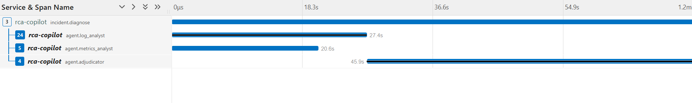
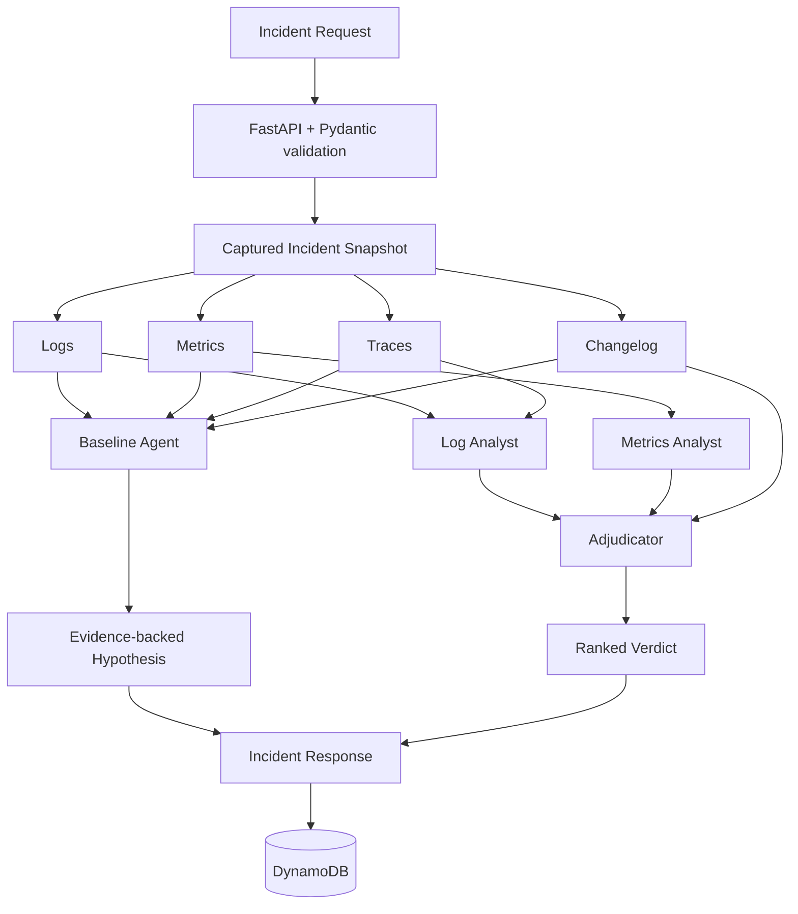

# RCA Copilot

Evidence-grounded root-cause diagnosis over logs, metrics, distributed traces, and change history.

**Problem:** Production incidents often surface as noisy downstream failures while the actual broken component is silent, making root-cause diagnosis difficult from any single telemetry source.

**What RCA Copilot does:** It investigates an incident window across multiple evidence sources, requires evidence-backed conclusions, and produces a ranked root-cause verdict with confidence and escalation metadata.

**Headline result:** Across **49 valid evaluation runs over four controlled fault scenarios**, the simpler single-agent baseline achieved **79% accuracy (22/28)** versus **48% (10/21)** for the multi-agent architecture. The experiment showed that adding agent specialization and parallelism can reduce diagnostic quality when evidence is compressed between agents.

## Trace: where the multi-agent overhead appears



A representative multi-agent run shows the two investigators starting concurrently, but the adjudicator taking approximately **45.9 seconds** by itself. The reconciliation stage is both the largest latency contributor and the point where detailed evidence has already been compressed into analyst reports.

## Evaluation results

Both configurations used:

- Claude Haiku 4.5 (`claude-haiku-4-5-20251001`)
- the same captured telemetry
- the same tools
- the same incident windows
- the same deterministic scoring rule

The architectural topology was the primary experimental variable.

| Scenario | Config | Valid runs | Correct | Accuracy | Mean confidence | Mean latency | Mean cost |
|---|---|---:|---:|---:|---:|---:|---:|
| C1 — valkey-cart stopped | baseline | 13 | 8 | **61.5%** | 0.90 | 27.8s | $0.088 |
| C1 — valkey-cart stopped | multi-agent | 6 | 3 | 50.0% | 0.73 | 76.5s | $0.202 |
| C2 — cart misconfigured | baseline | 5 | 5 | **100%** | 0.94 | 26.1s | $0.036 |
| C2 — cart misconfigured | multi-agent | 5 | 3 | 60.0% | 0.81 | 89.6s | $0.120 |
| C3 — product-catalog memory exhaustion | baseline | 5 | 4 | **80.0%** | 0.79 | 48.4s | $0.068 |
| C3 — product-catalog memory exhaustion | multi-agent | 5 | 0 | 0.0% | 0.72 | 76.5s | $0.106 |
| C4 — astronomy-db stopped | baseline | 5 | 5 | **100%** | 0.92 | 27.0s | $0.042 |
| C4 — astronomy-db stopped | multi-agent | 5 | 4 | 80.0% | 0.65 | 85.9s | $0.117 |

**Overall: baseline 22/28 (79%), multi-agent 10/21 (48%).**

The strongest controlled comparison is C2: identical evidence produced **100% baseline accuracy versus 60% multi-agent accuracy**, while the multi-agent configuration was approximately 3.4× slower and 3.3× more expensive.

Full analysis is available in [RESULTS.md](RESULTS.md).

## Failure taxonomy

A run is classified as:

- `correct` — expected component ranked first
- `outranked` — expected component found, but ranked below another cause
- `absent` — expected component never appeared
- `no_verdict` — pipeline completed without a submitted verdict
- `error` — execution failed before a verdict

| Scenario | Config | Correct | Outranked | Absent | No verdict | Error |
|---|---|---:|---:|---:|---:|---:|
| C1 | baseline | 8 | 0 | 5 | 0 | 8 |
| C1 | multi-agent | 3 | 2 | 1 | 0 | 0 |
| C2 | baseline | 5 | 0 | 0 | 0 | 0 |
| C2 | multi-agent | 3 | 0 | 1 | 1 | 0 |
| C3 | baseline | 4 | 0 | 1 | 0 | 0 |
| C3 | multi-agent | 0 | 0 | 4 | 1 | 0 |
| C4 | baseline | 5 | 0 | 0 | 0 | 0 |
| C4 | multi-agent | 4 | 0 | 1 | 0 | 0 |

The most important failure pattern was not caused by agent topology.

**Checkout was blamed in 11 of 14 attributable failed runs even though checkout was never the injected fault.** Its relatively high CPU and memory values repeatedly distracted the model despite explicit prompt instructions explaining that those values were not sufficient evidence of resource exhaustion.

C3 exposed the clearest architectural failure: the multi-agent configuration failed to rank `product-catalog` in all five runs, while the baseline succeeded in four of five.

## Why the multi-agent system underperformed

The investigators have access to detailed evidence, but the adjudicator does not.

The log analyst may collect dozens of log and trace evidence items and then compress them into a prose report. The metrics analyst does the same with quantitative telemetry. The adjudicator receives those reports rather than the original evidence payloads.

That creates an information bottleneck:

```text
raw telemetry
     ↓
investigator reasoning
     ↓
compressed prose report
     ↓
adjudicator reasoning
     ↓
verdict
```

The additional reasoning stage therefore adds latency and cost while potentially discarding evidence needed for the final decision.

The experiment is intentionally reported as measured: **for this task, model, prompt set, and scenario set, the simpler architecture performed better.**

## Architecture

RCA Copilot supports two diagnosis configurations.



### Baseline

One agent can query all five evidence tools:

- `search_logs`
- `get_metrics`
- `find_traces`
- `get_trace_detail`
- `get_recent_changes`

It investigates sequentially and submits one evidence-backed hypothesis.

### Multi-agent

LangGraph implements parallel fan-out and fan-in:

```text
START
 ├── log_analyst
 └── metrics_analyst
        ↓
    adjudicator
        ↓
       END
```

**Log analyst**

Owns qualitative request-level evidence:

- logs
- trace summaries
- full trace details

**Metrics analyst**

Owns quantitative evidence:

- service call rate
- service error rate
- p95 latency
- container memory ratio
- container CPU

**Adjudicator**

Receives investigator reports and uniquely owns the changelog.

The changelog is treated as resolving evidence rather than another independent hypothesis generator.

## Evidence contracts

All telemetry sources return one of three statuses:

```text
SUCCESS
NO_DATA
ERROR
```

This distinction is deliberate.

`NO_DATA` means the query succeeded and found nothing.

`ERROR` means the evidence source could not be queried reliably.

Those two states must not be treated equivalently during incident diagnosis.

Every evidence item receives an ID. The multi-agent investigators and adjudicator validate cited evidence IDs before accepting hypotheses or ranked verdicts.

## Context and cost controls

Large raw telemetry payloads are reduced before being passed to the model.

Examples:

- log results are capped and individual messages are truncated
- metric time series are summarized as first, last, min, max, and point count
- trace payloads are capped and span attributes are reduced to diagnostic fields
- repeated prompts use Anthropic prompt caching metadata

Additional runtime safeguards include:

- per-run token ceiling
- rolling hourly cost ceiling
- operational kill switch via `RCA_DISABLED`
- bounded retry with exponential backoff and jitter
- no retry for authentication/permission failures
- **16 KiB serialized alert-size limit** enforced by Pydantic before the RCA pipeline executes

The oversized-input chaos drill verified that a 1 MiB request is rejected with HTTP `422` before model execution.

## Incident scenarios

The evaluation dataset contains four deliberately injected failures.

| Scenario | Failure class | Expected root component |
|---|---|---|
| C1 | Dependency unavailable | `valkey-cart` |
| C2 | Misconfiguration | `cart` |
| C3 | Resource exhaustion | `product-catalog` |
| C4 | Dependency unavailable | `astronomy-db` |

Each scenario contains a fixed 15-minute evidence window: five minutes before the injected fault and ten minutes after it.

Telemetry was captured from:

- OpenSearch — logs
- Prometheus — metrics
- Jaeger — distributed traces
- a recorded changelog — human/deployment changes

The captured snapshots are committed under `scenarios/` so evaluations can replay identical evidence instead of querying a changing live system.

> The current API diagnoses these captured scenarios. The live source adapters are used to create snapshots; the deployed API is not yet wired to arbitrary production observability backends.

## Evaluation

Run one configuration:

```bash
uv run python -m eval.harness C1-valkey-cart-down --config baseline --n 5
```

Compare stored runs:

```bash
uv run python -m eval.report runs
```

Generate the failure taxonomy:

```bash
uv run python -m eval.taxonomy
```

Run the regression suite:

```bash
uv run python -m eval.regression
```

The scorer deliberately does not use an LLM judge.

Each scenario declares an `expected_component` before model execution. A run is correct only when that component appears in the **top-ranked cause**.

Component comparison is case-insensitive and normalizes hyphens and underscores.

This keeps evaluation deterministic and auditable.

## API

The FastAPI service exposes:

| Method | Endpoint | Purpose |
|---|---|---|
| `GET` | `/healthz` | Liveness check |
| `POST` | `/incidents` | Run a baseline or multi-agent diagnosis |
| `GET` | `/incidents/{incident_id}` | Retrieve a persisted diagnosis |

`/healthz` intentionally does not contact Anthropic or other downstream dependencies.

Incident results are persisted in DynamoDB.

## Observability

The application is instrumented with OpenTelemetry at the incident, agent, LLM-attempt, and tool levels.

The ECS task runs an AWS Distro for OpenTelemetry collector sidecar.

```text
Application
    ↓ OTLP
ADOT Collector
    ├── traces  → AWS X-Ray
    └── metrics → CloudWatch EMF
```

Metrics include:

- incident outcomes
- API outcomes
- agent duration
- token usage
- estimated model cost
- tool failures
- escalation count
- scheduled regression results

Operational alarms cover:

- exhausted provider retries
- per-run token ceiling
- evidence-tool failure
- regression-gate failure

Chaos testing is documented in `OPERATIONS.md`, including cases where the existing monitoring intentionally failed to detect a fault.

## Deployment

Infrastructure is defined with Terraform.

The AWS deployment includes:

- ECR
- ECS Fargate
- DynamoDB
- Systems Manager Parameter Store
- CloudWatch Logs
- CloudWatch metrics and alarms
- X-Ray
- SNS
- EventBridge Scheduler
- GitHub Actions OIDC IAM roles

The ECS task uses:

```text
0.5 vCPU
1 GiB memory
```

The application and ADOT collector run as containers in the same Fargate task.

The service normally remains at:

```text
desiredCount = 0
```

to minimize demo infrastructure cost.

### CI/CD

A push to `main` runs:

```text
GitHub push
    ↓
Ruff lint
    ↓
Ruff format check
    ↓
pytest
    ↓
GitHub OIDC → AWS
    ↓
Docker build
    ↓
ECR image tagged with Git commit SHA
    ↓
new ECS task definition
    ↓
ECS deployment
    ↓
/healthz smoke test
    ↓
scale service back to zero
```

ECR tags are immutable, and deployment images are identified by Git SHA rather than `latest`.

The ECS deployment circuit breaker is configured to roll back failed deployments automatically.

## Scheduled regression testing

EventBridge Scheduler runs the regression workload every seven days as a standalone Fargate task.

The production baseline is gated by scenario-specific minimum accuracy thresholds.

If a baseline scenario falls below its threshold:

```text
regression job
    ↓
regression_runs_total{outcome="fail"}
    ↓
CloudWatch alarm
    ↓
SNS notification
```

The multi-agent configuration remains experimental and is evaluated only after the baseline regression gate passes.

## Local setup

Requirements:

- Python 3.12
- `uv`
- Anthropic API key

Install:

```bash
uv sync --dev
```

Set the model credential and run an offline snapshot evaluation:

```powershell
$env:ANTHROPIC_API_KEY="<your-key>"

uv run python -m eval.harness `
    C1-valkey-cart-down `
    --config baseline `
    --n 1
```

To run the full FastAPI path locally, AWS credentials and a DynamoDB table are also required because completed incidents are persisted through the AWS store.

Start the API:

```bash
uv run uvicorn rca_copilot.api.main:app --reload
```

Check liveness:

```text
GET http://localhost:8000/healthz
```

## Repository structure

```text
rca-copilot/
├── src/rca_copilot/
│   ├── agents/          # baseline, investigators, adjudicator, LangGraph
│   ├── api/             # FastAPI service
│   ├── sources/         # logs, metrics, traces, changelog abstractions
│   ├── store/           # DynamoDB persistence
│   ├── telemetry/       # OpenTelemetry tracing and metrics
│   └── models.py        # evidence, hypotheses, verdict and API contracts
├── eval/                # harness, scoring, reporting, taxonomy, regression
├── scenarios/           # captured incident evidence
├── scripts/             # telemetry snapshot capture
├── terraform/           # AWS infrastructure
├── tests/
├── RESULTS.md
├── OPERATIONS.md
└── Dockerfile
```

## Engineering findings

The project produced several results that matter more than the agent topology itself:

1. **More agents did not improve accuracy.** Evidence compression between specialists and the adjudicator removed useful information.

2. **The loudest service is often not the root cause.** In three of four scenarios, the failed component produced little or no error-log signal while healthy downstream services were noisy.

3. **Model confidence is not calibrated reliability.** Correct and incorrect diagnoses can carry similar confidence values.

4. **`NO_DATA` and `ERROR` are fundamentally different.** Absence of evidence cannot be treated as evidence of absence.

5. **Observability changes the system you can operate.** Tracing exposed latency imbalance, tool failures, retry behaviour, and evidence-processing defects that output accuracy alone would not show.

6. **Operational controls belong outside the prompt.** Input validation, cost ceilings, retries, kill switches, regression gates, alarms, deployment rollback, and chaos drills provide safeguards that prompt instructions cannot.

## Limitations

This is an engineering experiment, not a production-ready autonomous incident responder.

Current limitations include:

- four controlled scenarios from one demo application
- one LLM family used for the measured comparison
- small per-scenario sample sizes
- exact component-name scoring rather than semantic judging
- multi-agent prompts were iterated during development
- captured snapshot replay rather than direct live diagnosis in the API
- confidence is not statistically calibrated
- public demo ECS networking is intentionally simpler than a production ingress design
- some chaos drills exposed monitoring gaps that remain intentionally documented rather than hidden

The goal is not to claim autonomous RCA is solved. The goal is to make the system measurable enough to determine **when it works, when it fails, and whether additional architectural complexity actually helps**.

## Further reading

- [RESULTS.md](RESULTS.md) — evaluation methodology, comparison and failure analysis
- [OPERATIONS.md](OPERATIONS.md) — alarms, runbook and chaos-drill reports
- [`src/rca_copilot/DECISIONS.md`](src/rca_copilot/DECISIONS.md) — engineering decisions and trade-offs
